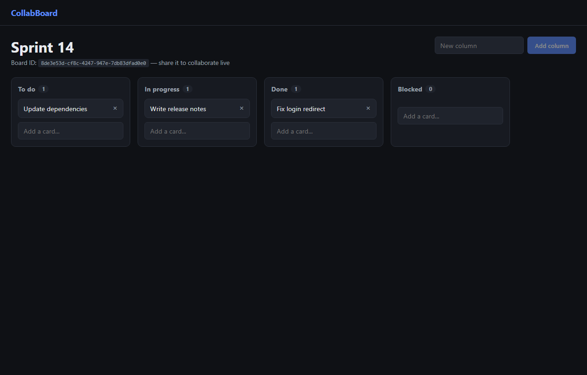

# CollabBoard

[](https://github.com/doudoumi14/collabboard/actions/workflows/ci.yml)

A real-time collaborative kanban board. Open the same board in two browser tabs and changes sync instantly over WebSockets — no page refresh, no polling.



## Stack

- **Backend:** Node.js, Express 5, TypeScript, Socket.io, in-memory store
- **Frontend:** React 19, TypeScript, Vite, socket.io-client, native HTML5 drag-and-drop
- **Tests:** Vitest (board logic)

## Features

- Create a board, get a shareable board ID — no account needed
- Add columns and cards
- Drag cards between columns or reorder within a column
- Every connected client sees changes the instant they happen
- Delete cards

## How it works

The server keeps boards in memory (`server/src/store.ts`), keyed by ID. Each browser client connects over a WebSocket, joins a Socket.io room named after the board ID, and the server re-broadcasts the full board state to that room after every mutation (add/move/delete card, add column). There's no client-side polling — updates are pushed.

## Running locally

### Backend

```bash
cd server
npm install
npm run dev
```

The API and WebSocket server run on `http://localhost:4001`.

### Frontend

```bash
cd client
npm install
npm run dev
```

The app runs on `http://localhost:5173` and proxies `/api` and `/socket.io` to the backend.

### Tests

```bash
cd server
npm test
```

## Project structure

```
collabboard/
  server/         Express + Socket.io server, in-memory board store, tests
  client/         React frontend (home, board view, socket client)
```
